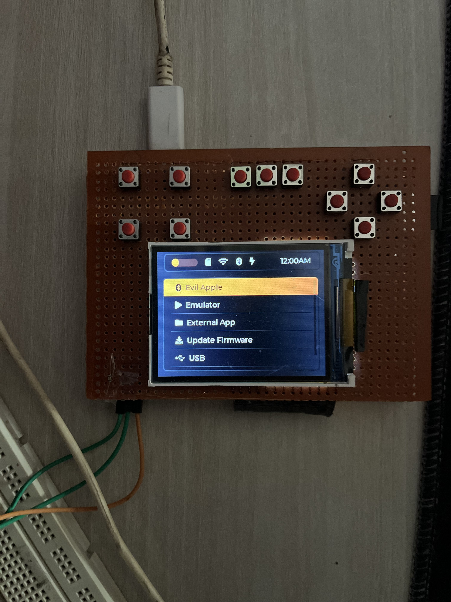
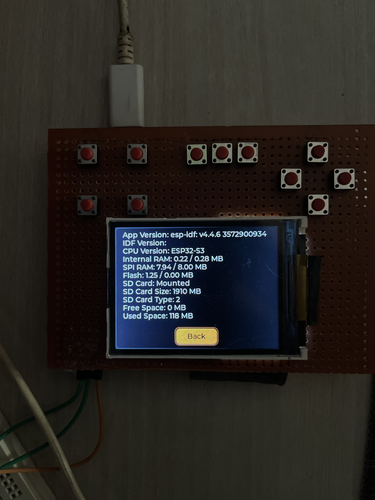
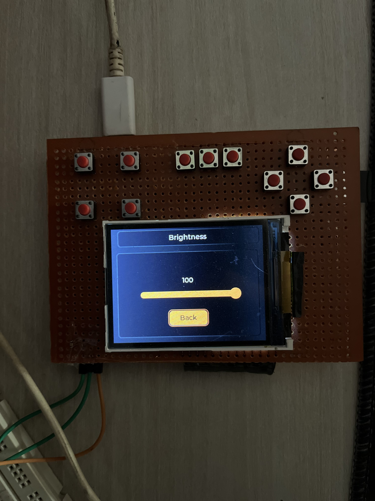
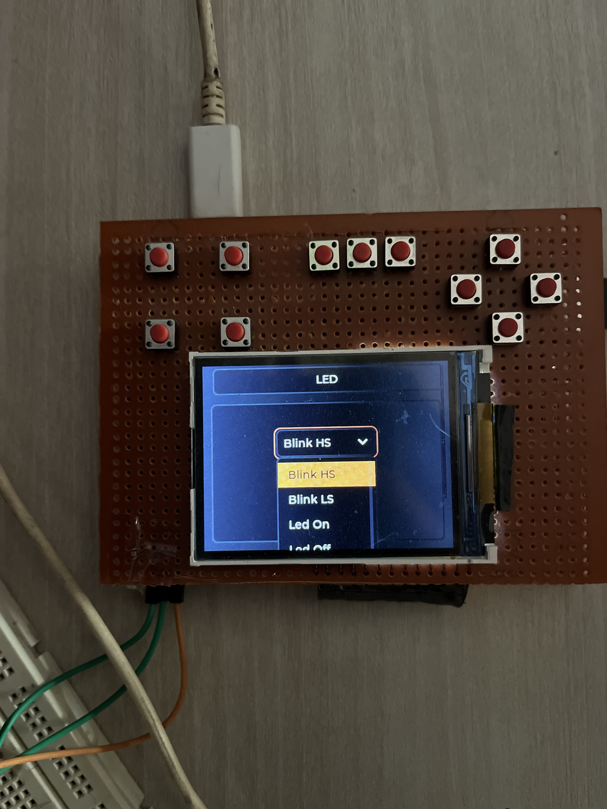
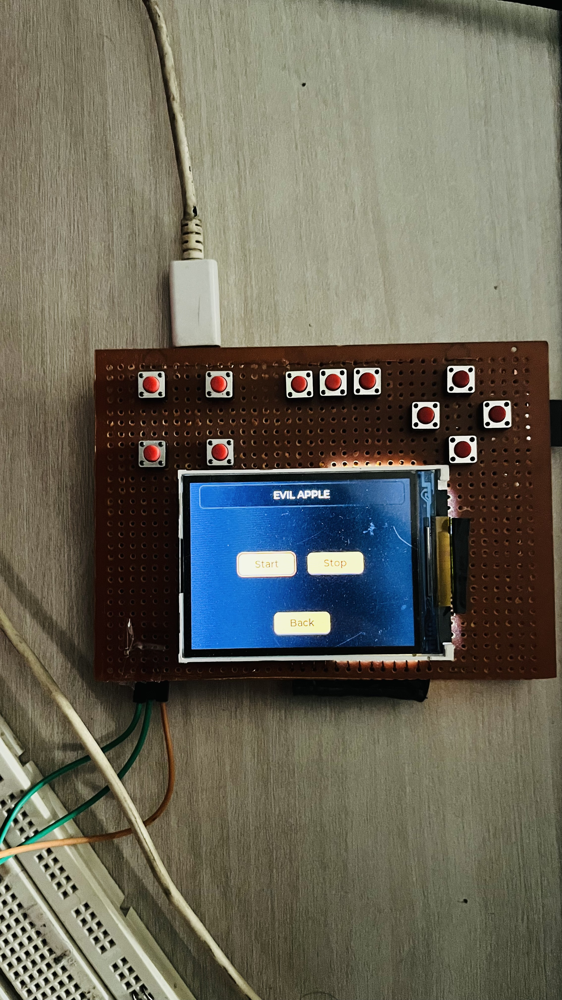

# microByte Arduino

A modular, feature-rich firmware for the ESP32-S3-DevKitC-1, designed for embedded applications with advanced UI, multitasking, and hardware abstraction.  
Supports LVGL GUI, FreeRTOS process management, OTA updates, external app loading, and robust system/resource monitoring.

---

## Features

- **Modular Drivers:** WiFi, SD, display (ST7789), sound, vibration, LED, user input
- **Process Manager:** Multitasking, resource monitoring, process callbacks
- **LVGL GUI:** Modern, touch-friendly user interface
- **OTA Updates:** Wireless firmware upgrades
- **External App Loader:** Run user apps from SD card
- **System Monitoring:** Heap/stack usage, task stats, watchdog
- **NTP Time Sync:** Accurate timekeeping
- **Logging & Error Handling:** ESP-IDF style logs, resource alerts
- **Power Management:** (Planned) Sleep modes, peripheral shutdown

---

## Hardware

- **Target:** ESP32-S3-DevKitC-1 (8MB QD, No PSRAM)
- **Display:** ST7789 SPI TFT
- **Input:** Buttons, vibration motor, LEDs, speaker/buzzer
- **Storage:** microSD card (SPI)
- **Connectivity:** WiFi

---

## Project Structure

```
src/
 ├── components/
 │    ├── core/           # Process manager, system, app loader
 │    ├── drivers/        # Hardware abstraction (SPI, display, input, etc.)
 │    ├── system/         # OTA, NTP, watchdog, logging
 │    └── ui/             # LVGL UI, screens, widgets
 ├── main.cpp             # Entry point
 └── ...
```

---

## Getting Started

### Prerequisites

- [PlatformIO](https://platformio.org/) or ESP-IDF toolchain
- ESP32-S3-DevKitC-1 board
- microSD card (optional, for app loader)

### Build & Flash

1. Clone the repository:
   ```
   git clone https://github.com/DRIFTYY777/microByte_Arduino.git
   cd microByte_Arduino
   ```

2. Build and upload:
   ```
   pio run --target upload
   ```

3. Monitor serial output:
   ```
   pio device monitor
   ```

---

## Usage

- On boot, the LVGL UI is displayed.
- Use hardware buttons for navigation.
- Apps can be loaded from SD card.
- OTA updates are available via WiFi.

---

## Customization

- **Pin assignments:** Edit in `src/components/drivers/` or use a centralized config (recommended).
- **Add drivers:** Place new drivers in `drivers/` and register with the core.
- **UI:** Modify or add screens in `ui/`.

---

## Troubleshooting

- **Linker errors:** Ensure all source files (e.g., `spiManager.c`) are included in the build.
- **SPI errors:** Check device handle initialization and SPI bus setup.
- **Resource warnings:** Monitor heap/stack usage via serial logs.

---

## Contributing

Pull requests and issues are welcome!  
Please document new modules and follow the existing code style.

---

## License

MIT License

---

## Screenshots


---

## Credits

- [LVGL](https://lvgl.io/)
- [ESP-IDF](https://docs.espressif.com/projects/esp-idf/en/latest/esp32s3/)
- [PlatformIO](https://platformio.org/)

---







